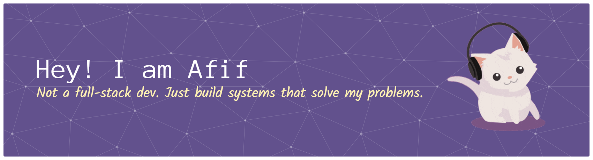

# 👋 Hi, I'm Afif



##  About Me
I don't have 8+ years of experience building high-performance, production-grade applications. I specialize in backend systems, API design, and full-stack architecture. My work spans fintech, SaaS platforms, and open-source infrastructure. I'm passionate about writing maintainable code, designing scalable systems, and mentoring junior developers.

## 🛠️ Tech Stack

| Category | Technologies |
|----------|--------------|
| **Languages** |  |
| **Frontend** |  |
| **Backend** |  |
| **Databases** |  |
| **DevOps & Cloud** |  |
| **Other Tools** |  |


## 🚀 Featured Projects

- **[StyleSync](https://stylesync-cyan-ten.vercel.app/)** — AI wardrobe manager & outfit generator with weather adaptation, powered by Google Gemini AI and computer vision.
- **[Media Hub](https://media-hub-downloader.onrender.com/)** — No-watermark video/audio downloader with multi-tier API fallback routing and local history persistence.
- **[CaféCash](https://caf-cash-1.vercel.app/)** — Cloud POS system with role-based auth, thermal receipt previews, and Google Sheets-backed analytics.
- **[Blood Pressure Tracker & Analytics Portal](https://script.google.com/macros/s/AKfycbxrp7-zLHsTKWoBPk68l6n4K1FAtdaW1TXO42jEY5_dn9HzUQ4ZEqg1K3MtJw9CL6BnBw/exec)** — Full-stack health tracking & medical analytics app. Built with Google Apps Script to automate cardiovascular metrics calculations and report summaries.

<picture data-importer="pacman">
  <source media="(prefers-color-scheme: dark)" srcset="https://raw.githubusercontent.com/sky4302/sky4302/pacman-output/pacman-contribution-graph-dark.svg?game=pacman">
  <source media="(prefers-color-scheme: light)" srcset="https://raw.githubusercontent.com/sky4302/sky4302/pacman-output/pacman-contribution-graph.svg?game=pacman">
  
</picture>

###

## 💻 Development Manifesto

```typescript
// ✅ Clean, descriptive, self-documentating code is non-negotiable.
interface Product {
  isActive: boolean;
  price: number;
}

function getPremiumActiveProducts(products: Product[]): Product[] {
  return products.filter(
    product => product.isActive && product.price > 100
  );
}

